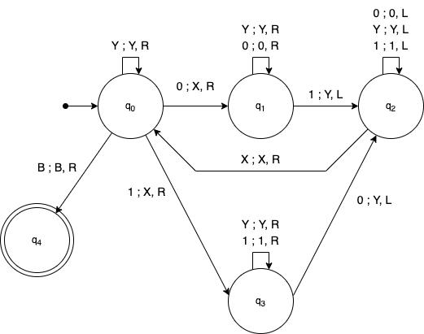

# Turing Machine

Design a Turing machine that accepts the set of strings with the same number of zeros as ones.

## Requirements

[Python 3](https://www.python.org/downloads/) 

## How to run?

1. You need to activate the virtual environment

> Run the script 

```shell
python ./src/main.py
```
## Representation of the turing machine

### Data

Q = {q0, q1, q2, q3, q4}
∑ = {0, 1}
Γ = {0, 1, X, Y, B}
s = {q0}
F = {q4}
∂ 


### Transition table
|            | 0           | 1           | X          | Y          | B          |
| ---------- | ----------- | ----------- | ---------- | ---------- | ---------- |
| →  q0      | (q1,X,R)    | (q3,X,R)    | ∅          | (q0,Y,R)   | (q4,B,R)   |
|    q1      | (q1,0,R)    | (q2,Y,L)    | ∅          | (q1,Y,R)   | ∅          |
|    q2      | (q2,0,L)    | (q2,1,L)    | (q0,X,R)   | (q2,Y,L)   | ∅          |
|    q3      | (q2,Y,L)    | (q3,1,R)    | ∅          | (q3,Y,R)   | ∅          |
| *  q4      | ∅           | ∅           | ∅          | ∅          | ∅          |

### Graph 

